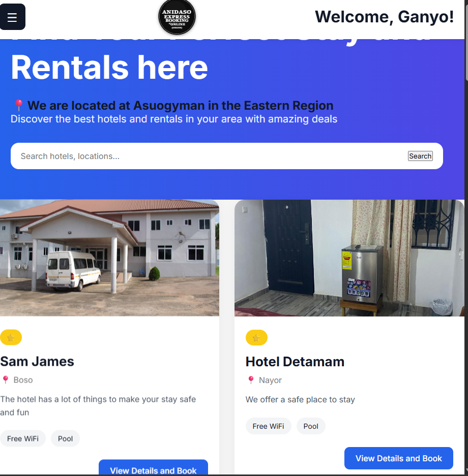

# Hotel Booker

Hotel Booker is a Django-based web application that allows users to browse hotels, book rooms, rent vehicles, and manage their bookings online. The platform is designed to provide a simple and user-friendly experience for customers looking for accommodation and transportation services.




## Features

### Hotel Booking

* Browse available hotels.
* View hotel details and amenities.
* Select and book hotel rooms.
* Track booking history.

### Rental Services

* Browse available rental vehicles and services.
* View rental details and pricing.
* Book rentals directly through the platform.
* Support for multiple rental images, locations, and prices.

### User Authentication

* User registration.
* Secure login and logout.
* Personalized user dashboard.

### Booking Management

* View booking history.
* Track rental and hotel reservations.
* Store customer booking information.

### Contact System

* Contact Us page for customer inquiries.
* Easy communication with administrators.

## Technologies Used

### Backend

* Python
* Django
* SQLite (Development Database)

### Frontend

* HTML5
* CSS3
* JavaScript
* Django Templates

### Additional Tools

* Django ORM
* Django Authentication System
* Media File Uploads

## Project Structure

```text
hotel_booking/
│
├── hotels/
├── rentals/
├── booking/
├── accounts/
├── contact/
├── payments/
│
├── static/
│   ├── css/
│   ├── images/
│   └── logo.svg
│
├── media/
│
├── templates/
│
├── manage.py
└── db.sqlite3
```

## Installation

### 1. Clone the Repository

```bash
git clone https://github.com/yourusername/hotel-booker.git
cd hotel-booker
```

### 2. Create Virtual Environment

```bash
python -m venv venv
```

### 3. Activate Virtual Environment

Windows:

```bash
venv\Scripts\activate
```

Mac/Linux:

```bash
source venv/bin/activate
```

### 4. Install Dependencies

```bash
pip install -r requirements.txt
```

### 5. Run Migrations

```bash
python manage.py migrate
```

### 6. Create Superuser

```bash
python manage.py createsuperuser
```

### 7. Start Development Server

```bash
python manage.py runserver
```

Visit:

```text
http://127.0.0.1:8000/
```

## Usage

### Hotels

Users can:

* Search hotels.
* View hotel details.
* Book available rooms.

### Rentals

Users can:

* Browse rental services.
* Select rental destinations.
* Book rental services.

### Admin Panel

Administrators can manage:

* Hotels
* Rentals
* Bookings
* Users
* Contact Messages

Access:

```text
http://anidasoexpressbooking/admin/
```

## Future Improvements

* Online payment integration.
* Email booking confirmations.
* Advanced search filters.
* Ratings and reviews.
* Real-time availability checking.
* Mobile application support.

## Author

Developed by: Your Name

## License

This project is intended to solve the problem of booking and renting an asuogyman and commercial use.
